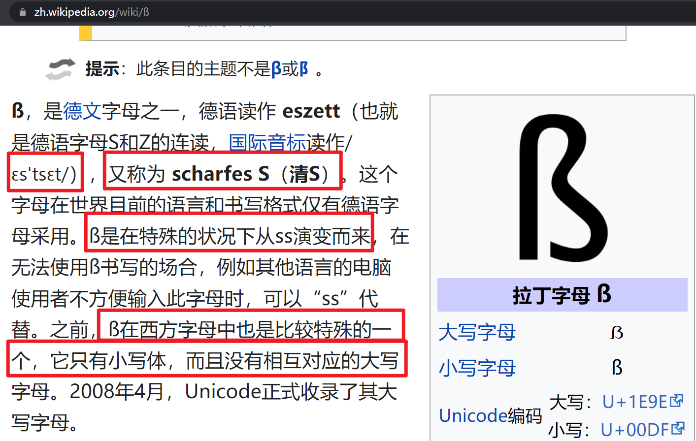
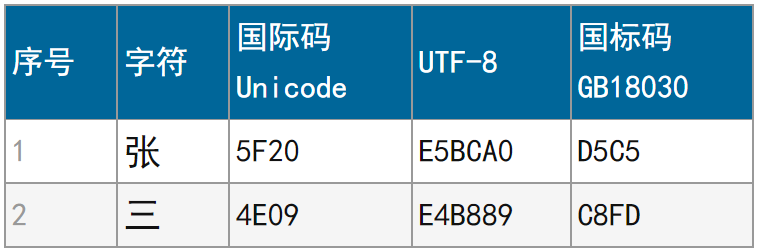
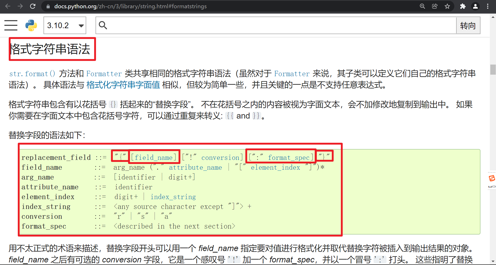
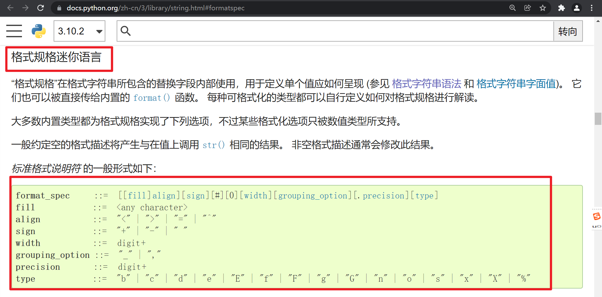
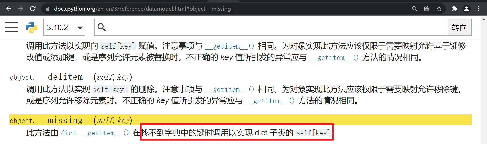

# 第02课 Python 字符串方法 01-10

## 01 - str.capitalize()

返回原字符串的副本，其首个字符**大写**，其余为**小写**。

在 3.8 版更改: 第一个字符现在被放入了 titlecase 而不是 uppercase。 这意味着**复合字母**类字符将只有首个字母改为大写，而不再是全部字符大写。

------

英语小写字母有26个 a b c d e f g h i j k l m n o p q r s t u v w x y z

德语小写字母有30个 a b c d e f g h i j k l m n o p q r s t u v w x y z ä ö ü ß



1. ß字符读作/ɛs'tsɛt/；
2. ß字符是在特殊的状况下从ss演变而来，ß字符是个复合字母类字符；
3. 比较特殊，它只有小写体，而且没有相互对应的大写字母；
4. 2008年4月，Unicode正式收录了其大写字母；
5. Python 有些字符串方法，会把ß字符转成两个小写的ss进行处理。例如capitalize。

|      | 短元音    | 长元音                |
| ---- | --------- | --------------------- |
| 英语 | 更少 less | 通过 pass             |
| 德语 | 必须 muss | 街道  Straße、Strasse |

备注：英语的必须must、街道street

## 02 - str.casefold()

返回原字符串**消除大小写**的副本。 消除大小写的字符串可用于忽略大小写的匹配。

消除大小写类似于转为小写，但是更加**彻底**一些，因为它会移除字符串中的所有大小写变化形式。 例如，德语小写字母 'ß' 相当于 "ss"。 由于它已经是小写了，lower() 不会对 'ß' 做任何改变；而 casefold() 则会将其转换为 "ss"。

消除大小写算法的描述请参见 Unicode 标准的 3.13 节。

3.3 新版功能.

## 03 - str.center(width[, fillchar])

返回**长度**为 width 的字符串，原字符串在其**正中**。 使用指定的 fillchar **填充**两边的空位（默认使用 ASCII 空格符）。 如果 width 小于等于 len(s) 则返回原字符串的副本。

## 04 - str.count(sub[, start[, end]])

返回子字符串 *sub* 在 [*start*, *end*] 范围内**非重叠**出现的**次数**。 可选参数 *start* 与 *end* 会被解读为**切片**表示法。

## 05 - str.encode(encoding='utf-8', errors='strict')

返回原字符串**编码**为**字节串**对象的版本。 默认编码为 'utf-8'。 可以给出 errors 来设置不同的**错误处理**方案。 errors 的默认值为 'strict'，表示编码错误会引发 UnicodeError。 其他可用的值为 'ignore', 'replace', 'xmlcharrefreplace', 'backslashreplace' 以及任何其他通过 codecs.register_error() 注册的值，请参阅 错误处理方案 小节。 要查看可用的编码列表，请参阅 标准编码 小节。

默认情况下，为了获得最佳性能，不会检测 errors 参数，而只在首次编码错误时用到它。若要检测 errors ，请启用 Python开发模式 或用 调试版本 。

在 3.1 版更改: 加入了对关键字参数的支持。

在 3.9 版更改: 现在，仅在开发模式和 调试模式 下才会检测 errors。

-------------



## 06 - str.endswith(suffix[, start[, end]])

如果字符串以指定的 suffix **结束**返回 True，否则返回 False。 suffix 也可以为由多个供查找的后缀构成的**元组**。 如果有可选项 start，将从所指定位置**开始**检查。 如果有可选项 end，将在所指定位置**停止**比较。

## 07 - str.expandtabs(tabsize=8)

返回字符串的副本，其中所有的**制表符**会由一个或多个**空格**替换，具体取决于当前列位置和给定的**制表符宽度**。 每 tabsize 个字符设为一个**制表位**（默认值 8 时设定的制表位在列 0, 8, 16 依次类推）。 要**展开**字符串，当前**列**将被设为零并逐一检查字符串中的每个字符。 如果字符为制表符 (\t)，则会在结果中插入一个或多个空格符，直到当前列等于下一个制表位。 （制表符本身不会被复制。） 如果字符为换行符 (\n) 或回车符 (\r)，它会被复制并将当前列重设为零。 任何其他字符会被不加修改地复制并将当前列加一，不论该字符在被打印时会如何显示。

```python
>>> '01\t012\t0123\t01234'.expandtabs()
'01      012     0123    01234'
>>> '01\t012\t0123\t01234'.expandtabs(4)
'01  012 0123    01234'
```

## 08 - find(sub[, start[, end]])

返回**子字符串** sub 在 s[start:end] **切片**内被**找到**的**最小**索引。 可选参数 start 与 end 会被解读为**切片**表示法。 如果 sub 未被找到则返回 -1。

注解

find() 方法应该只在你需要知道 sub 所在位置时使用。 要检查 sub 是否为子字符串，请使用 in 操作符:

```python
>>> 'Py' in 'Python'
True
```

## 09 - str.format(*args, **kwargs)

执行字符串**格式化**操作。 调用此方法的字符串可以包含字符串字面值或者以**花括号** {} 括起来的**替换域**。 每个替换域可以包含一个**位置参数**的**数字索引**，或者一个**关键字参数**的**名称**。 返回的字符串副本中每个替换域都会被**替换**为对应参数的字符串值。

```python
>>> "The sum of 1 + 2 is {0}".format(1+2)
'The sum of 1 + 2 is 3'
```

请参阅 格式字符串语法 了解有关可以在格式字符串中指定的各种格式选项的说明。

注解

当使用 n 类型 (例如: '{:n}'.format(1234)) 来格式化数字 (int, float, complex, decimal.Decimal 及其子类) 的时候，该函数会临时性地将 LC_CTYPE 区域设置为 LC_NUMERIC 区域以解码 localeconv() 的 decimal_point 和 thousands_sep 字段，如果它们是非 ASCII 字符或长度超过 1 字节的话，并且 LC_NUMERIC 区域会与 LC_CTYPE 区域不一致。 这个临时更改会影响其他线程。

在 3.7 版更改: 当使用 n 类型格式化数字时，该函数在某些情况下会临时性地将 LC_CTYPE 区域设置为 LC_NUMERIC 区域。

---------------

https://docs.python.org/zh-cn/3/library/string.html#formatstrings

```
replacement_field ::= "{" [field_name] ["!" conversion] [":" format_spec] "}"
```



https://docs.python.org/zh-cn/3/library/string.html#formatspec

```
format_spec ::= [[fill]align][sign][#][0][width][grouping_option][.precision][type]
```



## 10 - str.format_map(mapping)

类似于 str.format(**mapping)，不同之处在于 mapping 会被直接使用而不是复制到一个 dict。 适宜使用此方法的一个例子是当 mapping 为 dict 的子类的情况：

```python
>>> class Default(dict):
...     def __missing__(self, key):
...         return key

>>> '{name} was born in {country}'.format_map(Default(name='Guido'))
'Guido was born in country'
```

3.2 新版功能.

-------------

https://docs.python.org/zh-cn/3/reference/datamodel.html#object.__missing__



object.__missing__(self, key)
    此方法由 dict.__getitem__() 在找不到字典中的键时调用以实现 dict 子类的 self[key]。

--------

02-str-method-01-10.py

```python
"""
第02课 Python 字符串方法 01-10

@author  : zhouhuajian
@version : v1.0
"""

print('----------')
# 1. 首个字符大写，其余为小写
string = "thIS IS a senTENCE."
print(string.capitalize())
# 2. 首个字符大写，不是首个字母大写
string = "1. thIS IS a senTENCE."
print(string.capitalize())
# 3. 如果第一个字符是复合字母类字符，将只有首个字母改为大写，而不再是全部字符大写
# 什么是复合字母类字符？
# ß先转成了ss，再转成大写字母
# python 3.7-，所有字母大写 SS
# python 3.8+，只有首个字母大写 Ss
print("ß".capitalize())
# 查看Unicode 0~9999码位的所有复合字母
for i in range(0, 10000):
    str1 = chr(i)
    str2 = str1.capitalize()
    if len(str2) > 1:
        print(f"{str1}可能是复合字母类字符 {str2}")


print('-------------------')
# 1. 返回原字符串消除大小写的副本
string = "thIS IS a senTENCE."
print(string.casefold())
# 2. 消除大小写类似于转为小写，但是更加彻底一些，因为它会移除字符串中的所有大小写变化形式
print("ß".casefold())
print("ß".lower())


print("-------------------")
# 1. 返回长度为 width 的字符串，原字符串在其正中。 使用指定的 fillchar 填充两边的空位
print("开始".center(8, "="))
# 2. 如果不对称，则剩余的一个字符会添加到左边
print("开始".center(9, "="))
# 3. 默认使用 ASCII 空格符
print("开始".center(8))
# 4. 如果 width 小于等于 len(s) 则返回原字符串的副本
print("开始".center(1, "="))


print('---------------')
# 1. 返回子字符串 sub 在 [start, end] 范围内非重叠出现的次数。 可选参数 start 与 end 会被解读为切片表示法。
string = "number 1, number 2, number 3."
print(string.count("number"))
print(string.count("number", 6))
print(string.count("number", 6, 16))
# string[6:16]
# 2. 非重叠出现
string = "abababab"
print(string.count("aba"))


print('---------------')
# 1. 返回原字符串编码为字节串对象的版本。 默认编码为 'utf-8'。
print("张三".encode())
print("张三".encode(encoding="utf-8"))
# 2. 可以给出 errors 来设置不同的错误处理方案。
# print("张三".encode(encoding="ascii"))  # 报UnicodeEncodeError错误
print("张三".encode(encoding="ascii", errors="ignore"))
print("张三 is a test string".encode(encoding="ascii", errors="ignore"))


print('---------------')
# 1. 如果字符串以指定的 suffix 结束返回 True，否则返回 False。
print("main.py".endswith(".py"))
print("main.py".endswith(".c"))
# 2. suffix 也可以为由多个供查找的后缀构成的元组。
print("main.py".endswith((".py", ".c", ".cpp")))
print("main.py".endswith((".java", ".c", ".cpp")))
# 如果有可选项 start，将从所指定位置开始检查。 如果有可选项 end，将在所指定位置停止比较。
print("main.py".endswith(".py", -3))
print("main.py".endswith(".py", 5, 7))


print('---------------')
# 1. 返回字符串的副本，其中所有的制表符会由一个或多个空格替换，具体取决于当前列位置和给定的制表符宽度。
# 每 tabsize 个字符设为一个制表位
string = "Name\tGender\tAge"
# 3个制表位
# 每8个字符设为一个制表位
print(string.expandtabs())
# 3个制表位
# 每10个字符设为一个制表位
print(string.expandtabs(tabsize=10))
# 4个制表位
# 每5个字符设为一个制表位
print(string.expandtabs(tabsize=5))
# 如果字符为换行符 (\n) 或回车符 (\r)，它会被复制并将当前列重设为零。
print('---------')
string = "Name\tGender\tAge\nJack\tmale\t18\nLucy\tfemale\t20"
print(string.expandtabs(tabsize=8))


print('------------')
# 返回子字符串 sub 在 s[start:end] 切片内被找到的最小索引
string = "Friday, Saturday, Sunday"
print(string.find("day"))
print(string.find("day", 8))  # 返回的索引从开头算起，而不是切片的位置
print(string[8:])
print(string.find("day", 8, 16))
print(string[8:16])
#  如果 sub 未被找到则返回 -1
print(string.find("Monday"))


print('----------------------')
# 执行字符串格式化操作。 调用此方法的字符串可以包含字符串字面值或者以花括号 {} 括起来的替换域。 每个替换域可以包含一个位置参数的数字索引，或者一个关键字参数的名称。 返回的字符串副本中每个替换域都会被替换为对应参数的字符串值。
"""
假设有数据
学号 名字  成绩 超过百分之多少的学生
1    Lucy  356  0.8056
要求输出“0001 Lucy 356 80.56%”
"""
# 1. 每个替换域可以包含一个位置参数的数字索引
string = "{0:0>4} {1} {2} {3:.2%}".format(1, "Lucy", 95, 0.8056)
print(string)
# 可以省略位置参数的数字索引，默认从0开始
string = "{:0>4} {} {} {:.2%}".format(1, "Lucy", 95, 0.8056)
print(string)
# 2. 每个替换域可以包含一个位置参数的数字索引，或者一个关键字参数的名称。
string = "{id:0>4} {name} {score} {percentage:.2%}".format(id=1, name="Lucy", score=95, percentage=0.8056)
print(string)
# 可以位置参数的数字索引和关键字参数的名称一块使用
string = "{0:0>4} {1} {score} {percentage:.2%}".format(1, "Lucy", score=95, percentage=0.8056)
print(string)
# 关键字参数可以使用**dict的方式来传递，这是Python的语法糖
student = {
    "id": 1,
    "name": "Lucy",
    "score": 96,
    "percentage": 0.8056
}
string = "{id:0>4} {name} {score} {percentage:.2%}".format(**student)
print(string)


print('--------------------')
# 类似于 str.format(**mapping)，不同之处在于 mapping 会被直接使用而不是复制到一个 dict。
# 1. 类似于 str.format(**mapping)
string = "{id:0>4} {name} {score} {percentage:.2%}".format(**student)
print(string)
string = "{id:0>4} {name} {score} {percentage:.2%}".format_map(student)
print(string)
# 2. 不同之处在于 mapping 会被直接使用而不是复制到一个 dict
# Python中字典是可变变量，传字典给函数或方法，相当于其他语言的传参数引用
print('--------------------')
student = {
    "id": 1,
    "name": "Lucy",
    "score": 96,
    "percentage": 0.8056
}
def format(*args, **kwargs):
    print("接受到数据：")
    print(kwargs)
    kwargs['name'] = 'kathy'
def format_map(mapping):
    print("接受到数据：")
    print(mapping)
    mapping['name'] = 'kathy'
format(**student)
print("学生的数据：")
print(student)
# format_map(student)
# print("学生的数据：")
# print(student)
```

