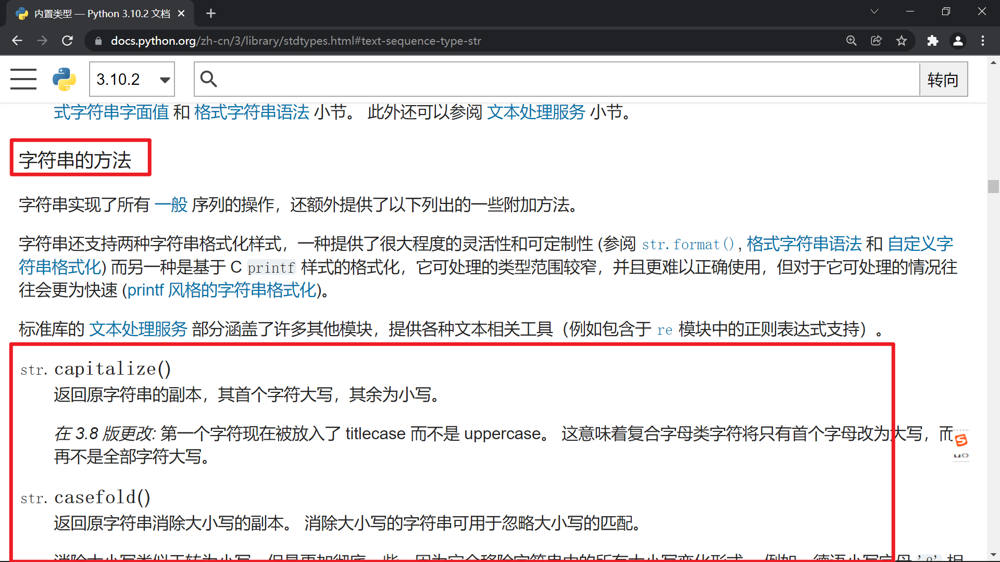
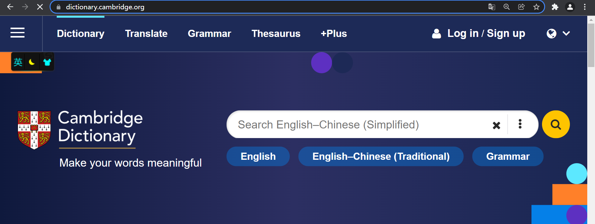

# 第01课 课程介绍

## 一. 课程内容

介绍 python 47 个字符串方法

https://www.python.org/

https://docs.python.org/zh-cn/3/library/stdtypes.html#string-methods

https://docs.python.org/3/library/stdtypes.html#string-methods





## 二. 快速演示6个字符串方法


01-course-intro.py

```python
"""
第01课 课程介绍 演示6个字符串方法

@author  : zhouhuajian
@version : v1.0
"""

languages = "c,c++,python"
language_list = languages.split(",")
print(language_list)

print('-----------')
print(",".join(language_list))

print('-----------')
# 实现输出0001 0002 0003
for i in range(1, 4):
    # print(str(i).rjust(4, "0"))
    print(str(i).zfill(4))

print('-----------')
print('========== 开始 ==========')
print(" 开始 ".center(24, "="))

print('-----------')
students = """Name\tGender\tAge
Jack\tmale\t18
Tom\tmale\t6
Lucy\tfemale\t20"""
print(students)
print('-----------')
print(students.expandtabs(tabsize=8))
```

## 三. 课程环境

### 2.1 操作系统

Windows 11

### 2.2 Python 版本

Python 3.10.2 (大家使用 Python 3 即可)

https://www.python.org/downloads/release/python-3102/


### 2.3 PyCharm 编辑器

https://www.jetbrains.com/pycharm/download


### 四. 单词读音

英国剑桥大学词典 https://dictionary.cambridge.org/



