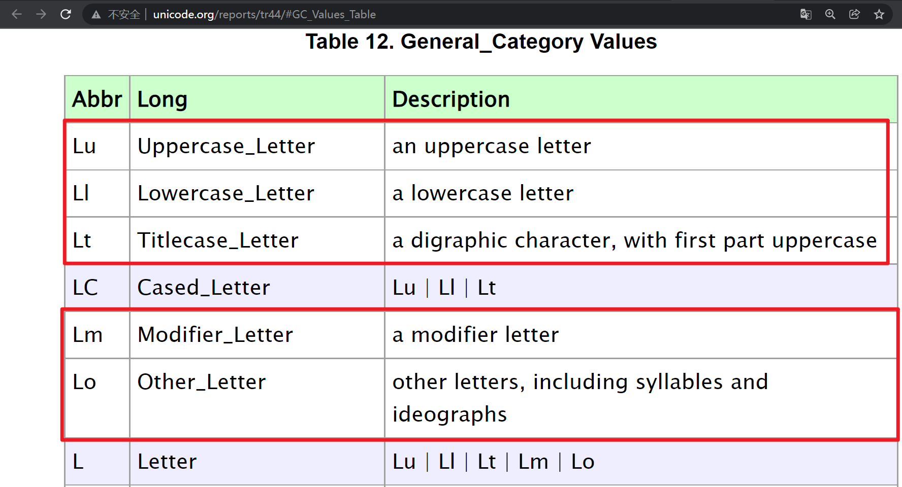
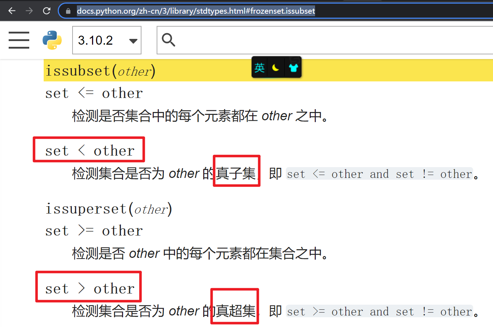
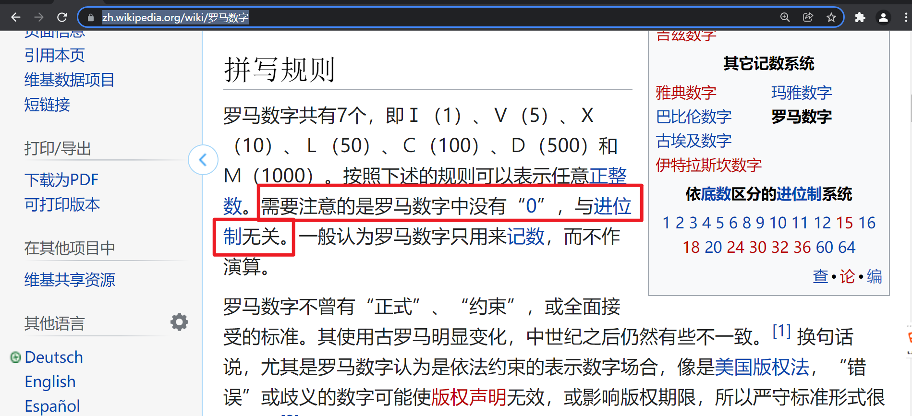
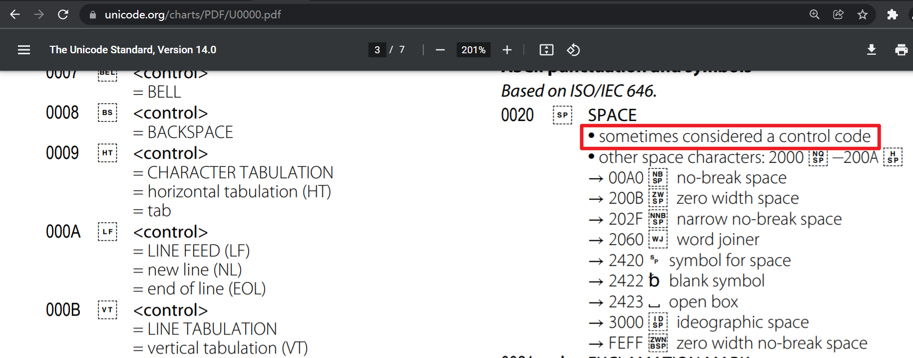

# 第03课 Python 字符串方法 11-20

## 11 - str.index(sub[, start[, end]])

类似于 find()，但在**找不到**子字符串时会引发 ValueError。

## 12 - str.isalnum()

如果字符串中的**所有**字符都是**字母或数字**且至少有**一个**字符，则返回 True ， 否则返回 False 。 如果 c.isalpha() ， c.isdecimal() ， c.isdigit() ，或 c.isnumeric() 之中有一个返回 True ，则字符``c``是字母或数字。

-------

https://docs.python.org/3/library/stdtypes.html#str.isalnum

## 13 - str.isalpha()

如果字符串中的**所有**字符都是**字母**，并且至少有**一个**字符，返回 True ，否则返回 False 。字母字符是指那些在 Unicode 字符数据库中定义为 "Letter" 的字符，即那些具有 "Lm"、"Lt"、"Lu"、"Ll" 或 "Lo" 之一的通用类别属性的字符。 注意，这与 Unicode 标准中定义的"字母"属性不同。

-----------------

http://www.unicode.org/reports/tr44/#GC_Values_Table



## 14 - str.isascii()

如果字符串为**空**或字符串中的**所有**字符都是 ASCII ，返回 True ，否则返回 False 。ASCII 字符的码点范围是 U+0000-U+007F 。

3.7 新版功能.

--------

https://www.asciitable.com/

https://www.unicode.org/charts/PDF/U0000.pdf

## 15 - str.isdecimal()

如果字符串中的**所有**字符都是**十进制**字符且该字符串至少有**一个**字符，则返回 True ， 否则返回 False 。十进制字符指那些可以用来**组成**10进制数字的字符，例如 U+0660 ，即阿拉伯字母数字0 。 **严格**地讲，十进制字符是 Unicode 通用类别 "Nd" 中的一个字符。

-------

https://docs.python.org/3/library/stdtypes.html#str.isdecimal

https://www.unicode.org/L2/L2012/12310-numeric-type-def.html

http://www.unicode.org/reports/tr44/#GC_Values_Table

Python 中 decimal digit numeric number的定义

decimal 

十进制数字 （各个国家的0到9，基于10，能组成有意义的数字，例如他有1234块钱。）

digit   (digit > decimal)

数字 （各个国家的0到9，包括decimal和不能组成有意义数字的基于10的数字，例如他有¹²³⁴块钱，他有➀➁➂➃块钱。）

numeric  (numeric > digit > decimal)

有数字值的数字 （各个国家的数字，包括decimal、digit和其他有数字值但不是基于10的数字，例如他有ⅠⅡⅢⅣ块钱，他有⅐⅑⅒块钱。）

number 

数字 （0 1 2 3 4 5 6 7 8 9 10 11 12 13 14 15 ... 100 ... 1000 ... 1234 ... 10000 ...）

## 16 - str.isdigit()

如果字符串中的**所有**字符都是数字，并且至少有**一个**字符，返回 True ，否则返回 False 。 数字包括**十进制**字符和需要特殊处理的数字，如兼容性上标数字。这包括了不能用来组成 10 进制数的数字，如 Kharosthi 数。 **严格**地讲，数字是指属性值为 Numeric_Type=Digit 或 Numeric_Type=Decimal 的字符。

-------

https://www.unicode.org/L2/L2012/12310-numeric-type-def.html

https://docs.python.org/zh-cn/3/library/stdtypes.html#frozenset.issubset



## 17 - str.isidentifier()

如果字符串是有效的**标识符**，返回 True ，依据语言定义，  [标识符和关键字](https://docs.python.org/zh-cn/3/reference/lexical_analysis.html#identifiers)节。

调用 keyword.iskeyword() 来检测字符串 s 是否为保留标识符，例如 def 和 class。

示例：

```python
>>> from keyword import iskeyword
>>> 'hello'.isidentifier(), iskeyword('hello')
(True, False)
>>> 'def'.isidentifier(), iskeyword('def')
(True, True)
```

## 18 - str.islower()

如果字符串中至少有**一个**区分大小写的字符且此类字符**均为小写**则返回 True ，否则返回 False 。

## 19 - str.isnumeric()

如果字符串中至少有**一个**字符且**所有**字符均为**数值**字符则返回 True ，否则返回 False 。 数值字符**包括**数字字符，以及所有在 Unicode 中设置了数值特性属性的字符，例如 U+2155, VULGAR FRACTION ONE FIFTH。 **正式**的定义为：数值字符就是具有特征属性值 Numeric_Type=Digit, Numeric_Type=Decimal 或 Numeric_Type=Numeric 的字符。

---------------------

https://www.unicode.org/L2/L2012/12310-numeric-type-def.html

https://zh.wikipedia.org/wiki/%E7%BD%97%E9%A9%AC%E6%95%B0%E5%AD%97



## 20 - str.isprintable()

如果字符串中**所有**字符均为可打印字符或字符串为**空**则返回 True ，否则返回 False 。 不可打印字符是在 Unicode 字符数据库中被定义为 "Other" 或 "Separator" 的字符，例外情况是 ASCII **空格**字符 (0x20) 被视作可打印字符。 （请注意在此语境下可打印字符是指当对一个字符串发起调用 repr() 时不必被转义的字符。 它们与字符串写入 sys.stdout 或 sys.stderr 时所需的处理无关。）

-------

https://www.asciitable.com/

https://www.unicode.org/charts/PDF/U0000.pdf



-----------

03-str-method-11-20.py

```python
"""
第03课 Python 字符串方法 11-20

@author  : zhouhuajian
@version : v1.0
"""

print('------------')
# 1. 类似于 find()，返回子字符串 sub 在 s[start:end] 切片内被找到的最小索引
string = "book 1, book 2, book 3"
print(string.find("book"))
print(string.index("book"))
print(string.index("book", 8))
print(string.index("book", 8, 14))
# find 如果 sub 未被找到则返回 -1
print(string.find("apple"))
# 2. index 在找不到子字符串时会引发 ValueError
# print(string.index("apple"))


print('------------')
# 如果字符串中的所有字符都是字母或数字且至少有一个字符，则返回 True ， 否则返回 False 。
# 1. 如果字符串中的所有字符都是字母或数字，则返回 True
print("abcdABCD1234".isalnum())
print("abcdABCD".isalnum())
print("1234".isalnum())
# 2. !!!这里的字母和数字，是全球各个国家的字母和数字，不是只有A-Za-z0-9
# 如果 c.isalpha() ， c.isdecimal() ， c.isdigit() ，或 c.isnumeric() 之中有一个返回 True ，则字符``c``是字母或数字
print('--------------------')
for i in range(0, 10000):
    single_char_string = chr(i)
    methods = ('isalpha', 'isdecimal', 'isdigit', 'isnumeric')
    for method in methods:
        if getattr(single_char_string, method)():
            print(single_char_string, end=" ")
            break
print()
print('--------------------')
# 3. 如果只想判断A-Za-z0-9，可以使用正则表达式
import re
print(re.fullmatch("[A-Za-z0-9]+", "abcdABCD1234"))
# 4. 如果字符串中的所有字符都是字母或数字且至少有一个字符，则返回 True ， 否则返回 False 。
print("abcd    ABCD\t\r\n1234".isalnum())
print("".isalnum())


print('-------------')
# 1. 如果字符串中的所有字符都是字母，并且至少有一个字符，返回 True ，否则返回 False
print("abcdABCD".isalpha())
# 2. !!!这里的字母，是全球各个国家的字母，不是只有A-Za-z
# 字母字符是指那些在 Unicode 字符数据库中定义为 "Letter" 的字符，即那些具有 "Lm"、"Lt"、"Lu"、"Ll" 或 "Lo" 之一的通用类别属性的字符。
print('-------------')
for i in range(0, 10000):
    single_char_string = chr(i)
    if single_char_string.isalpha():
        print(single_char_string, end=" ")
print()
print('-------------')
# 3. 如果只想判断A-Za-z，可以使用正则表达式
import re
print(re.fullmatch("[A-Za-z]+", "abcdABCD"))
# 4. 如果字符串中的所有字符都是字母，并且至少有一个字符，返回 True ，否则返回 False
print("abcdABCD1234".isalpha())
print("".isalpha())


print('-----------------------')
# 如果字符串为空或字符串中的所有字符都是 ASCII ，返回 True ，否则返回 False 。
# ASCII 字符的码点范围是 U+0000-U+007F 。
print("ABCDabcd1234!@#$ \t\r\n".isascii())
print("".isascii())
print("这是非ASCII字符".isascii())


print('---------------------')
# 1. 如果字符串中的所有字符都是十进制字符且该字符串至少有一个字符，则返回 True ， 否则返回 False 。
print("0123456789".isdecimal())
# 2. !!!这里的十进制字符，是全球各个国家的十进制字符，不是只有0-9
# 十进制字符指那些可以用来组成10进制数字的字符，
# 严格地讲，十进制字符是 Unicode 通用类别 "Nd" 中的一个字符
print('-------------')
for i in range(0, 10000):
    single_char_string = chr(i)
    if single_char_string.isdecimal():
        print(single_char_string, end="")
print()
print('-------------')
# 3. 如果只想判断0-9，可以使用正则表达式
import re
print(re.fullmatch("[0-9]+", "0123456789"))
# 4. 如果字符串中的所有字符都是十进制字符且该字符串至少有一个字符，则返回 True ， 否则返回 False 。
print("0123456789abcdABCD".isdecimal())
print("".isdecimal())


print('---------------------')
# 1. 如果字符串中的所有字符都是数字，并且至少有一个字符，返回 True ，否则返回 False
print("0123456789".isdigit())
print("⁰¹²³⁴⁵⁶⁷⁸⁹".isdigit())
print("➀➁➂➃➄➅➆➇➈".isdigit())
# 2. !!!这里的数字字符，是全球各个国家的数字字符
# 严格地讲，数字是指属性值为 Numeric_Type=Digit 或 Numeric_Type=Decimal 的字符。
print('-------------')
isdecimal_list = []
isdigit_list = []
for i in range(0, 10000):
    single_char_string = chr(i)
    if single_char_string.isdecimal():
        isdecimal_list.append(single_char_string)
    if single_char_string.isdigit():
        isdigit_list.append(single_char_string)
print("".join(isdigit_list))
print('-------------')
# 3. 集合isdigit包含集合isdecimal，集合isdecimal是集合isdigit的真子集
# 数字包括十进制字符和需要特殊处理的数字，如兼容性上标数字。
print('isdecimal < isdigit')
print(set(isdecimal_list) < set(isdigit_list))
# 4. 如果字符串中的所有字符都是数字，并且至少有一个字符，返回 True ，否则返回 False
print("0123456789⁰¹²³⁴⁵⁶⁷⁸⁹abcdABCD".isdigit())
print("".isdigit())


print('------------------------------')
# 如果字符串是有效的标识符，返回 True
# 1. 在 ASCII 范围内（U+0001..U+007F），有效标识符字符为： 大小写字母 A 至 Z、下划线 _ 、数字 0 至 9，但不能以数字开头。
print("variable".isidentifier())
print("this_is_a_variable".isidentifier())  # 下划线命名法
print("ThisIsAVariable".isidentifier())  # 驼峰命名法
print("this_is_the_first_variable_01".isidentifier())
# 2. 但不能以数字开头
print("01variable".isidentifier())
# 3. Python 3.0 引入了 ASCII 之外的更多字符
# 例如，中文字符 （不建议大家使用）
print("这是一个变量".isidentifier())
print('----------------')
# Pycharm编辑器有警告，但不是错误，能编译通过，并且能正常运行
名字 = "Gina"
性别 = "女"
年龄 = 18
print(名字)
print(性别)
print(年龄)


print('-------------------')
# 1. 如果字符串中至少有一个区分大小写的字符且此类字符均为小写则返回 True ，否则返回 False 。
print("abcdefg".islower())
# !!!这里的小写字符，是全球各个国家的小写字符，不只是a-z
print('-------------')
for i in range(0, 10000):
    single_char_string = chr(i)
    if single_char_string.islower():
        print(single_char_string, end=" ")
print()
print('-------------')
# 3. 如果只想判断a-z，可以使用正则表达式
import re
print(re.fullmatch("[a-z]+", "abcdefg"))
# 4. 如果字符串中至少有一个区分大小写的字符且此类字符均为小写则返回 True ，否则返回 False 。
print("abcdEFG".islower())
print("abcdefg至少有一个区分大小写的字符".islower())
print("没有区分大小写的字符".islower())


print('---------------------')
# 1. 如果字符串中至少有一个字符且所有字符均为数值字符则返回 True ，否则返回 False
print("0123456789".isnumeric())
print("⁰¹²³⁴⁵⁶⁷⁸⁹".isnumeric())
print("➀➁➂➃➄➅➆➇➈".isnumeric())
print("⅐⅑⅒".isnumeric())
print("ⅠⅡⅢⅣⅤⅥⅦⅧⅨⅩⅪⅫ".isnumeric())
# Ⅰ（1）、Ⅴ（5）、Ⅹ（10）、Ⅼ（50）、Ⅽ（100）、Ⅾ（500）和Ⅿ（1000）
# 2. !!!这里的数值字符，是全球各个国家的数值字符
# 正式的定义为：数值字符就是具有特征属性值 Numeric_Type=Digit, Numeric_Type=Decimal 或 Numeric_Type=Numeric 的字符
print('-------------')
isdecimal_list = []
isdigit_list = []
isnumeric_list = []
for i in range(0, 10000):
    single_char_string = chr(i)
    if single_char_string.isdecimal():
        isdecimal_list.append(single_char_string)
    if single_char_string.isdigit():
        isdigit_list.append(single_char_string)
    if single_char_string.isnumeric():
        isnumeric_list.append(single_char_string)
print("".join(isnumeric_list))
print('-------------')
# 3. 集合isnumeric包含集合isdigit，集合isdigit是集合isnumeric的真子集
# 集合isdigit包含集合isdecimal，集合isdecimal是集合isdigit的真子集
# 数值字符包括数字字符，以及所有在 Unicode 中设置了数值特性属性的字符，
print('isdecimal < isdigit < isnumeric')
print(set(isdecimal_list) < set(isdigit_list) < set(isnumeric_list))
# 4. 如果字符串中至少有一个字符且所有字符均为数值字符则返回 True ，否则返回 False
print('------------')
print("0123456789⁰¹²³⁴⁵⁶⁷⁸⁹⅐⅑⅒ⅠⅡⅢⅣabcdABCD".isnumeric())
print("".isnumeric())


print('----------------')
# 1. 如果字符串中所有字符均为可打印字符或字符串为空则返回 True ，否则返回 False
print("abcdABCD1234!@#$中文汉字".isprintable())
print("".isprintable())
# 2.  不可打印字符是在 Unicode 字符数据库中被定义为 "Other" 或 "Separator" 的字符，例外情况是 ASCII 空格字符 (0x20) 被视作可打印字符。
print("          ".isprintable())
print('--------------')
for i in range(0, 10000):
    single_char_string = chr(i)
    if not single_char_string.isprintable():
        print(single_char_string, end=" ")
print()
print('-----------------')
# 3. 一般控制字符就是不可打印字符
# 例如ASCII表中0~31以及127，共32个字符都是控制字符
# ASCII 32字符，空格字符，可以被认为是控制字符，也可以不是
char_list = ["\t", "\r", "\n", "\b"]
for char in char_list:
    print(char.isprintable(), end=" ")


```


