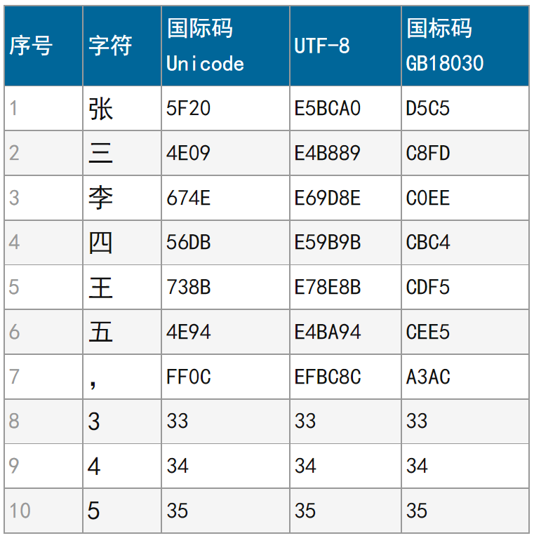
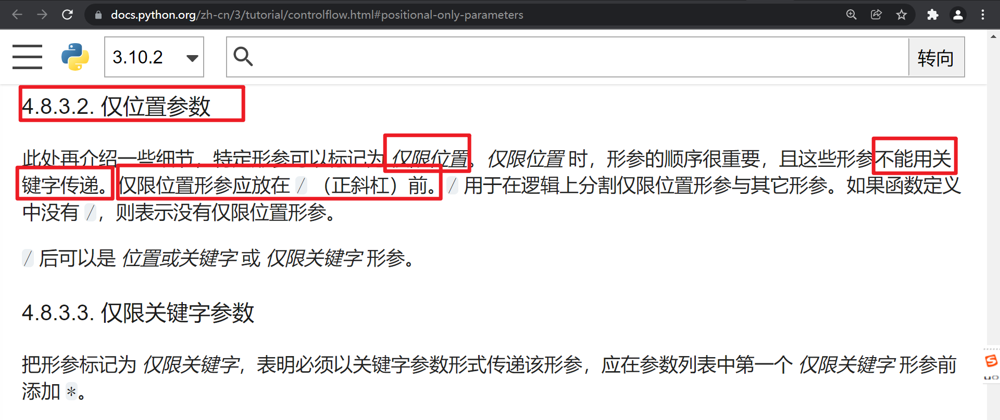

# 第04课 Python 字符串方法 21-30

## 21 - str.isspace()

如果字符串中只有**空白**字符且至少有**一个**字符则返回 True ，否则返回 False 。

空白 字符是指在 Unicode 字符数据库 (参见 unicodedata) 中主要类别为 Zs ("Separator, space") 或所属双向类为 WS, B 或 S 的字符。

## 22 - str.istitle()

如果字符串中至少有**一个**字符且为**标题**字符串则返回 True ，例如大写字符之后只能带非大写字符而小写字符必须有大写字符打头。 否则返回 False 。

--------

Python中的title

This Is A Title

Today Is Sunday

## 23 - str.isupper()

如果字符串中至少有**一个**区分大小写的字符且此类字符均为**大写**则返回 True ，否则返回 False 。

## 24 - str.join(iterable)

返回一个由 iterable 中的字符串**拼接**而成的字符串。 如果 iterable 中存在任何**非字符串值**包括 bytes 对象则会引发 TypeError。 调用该方法的字符串将作为元素之间的**分隔**。

## 25 - str.ljust(width[, fillchar])

返回**长度**为 width 的字符串，原字符串在其中**靠左**对齐。 使用指定的 fillchar **填充**空位 (默认使用 ASCII 空格符)。 如果 width 小于等于 len(s) 则返回原字符串的副本。

---------------

https://docs.python.org/3/library/stdtypes.html#str.ljust

l : left 左边

just : justified 调整的

## 26 - str.lower()

返回原字符串的副本，其所有区分大小写的字符**均**转换为**小写**。

所用转换小写算法的描述请参见 Unicode 标准的 3.13 节。

## 27 - str.lstrip([chars])

返回原字符串的副本，**移除**其中的**前导**字符。 chars 参数为指定要移除字符的**字符串**。 如果省略或为 None，则 chars 参数默认移除**空白**符。 实际上 chars 参数并非指定单个前缀；而是会移除参数值的所有**组合**:

```python
>>> '   spacious   '.lstrip()
'spacious   '
>>> 'www.example.com'.lstrip('cmowz.')
'example.com'
```

参见 str.removeprefix() ，该方法将删除单个前缀字符串，而不是全部给定集合中的字符。 例如:

```python
>>> 'Arthur: three!'.lstrip('Arthur: ')
'ee!'
>>> 'Arthur: three!'.removeprefix('Arthur: ')
'three!'
```

-------

l : left 左边

strip : 移除

## 28 - static str.maketrans(x[, y[, z]])

此静态方法返回一个可供 str.translate() 使用的**转换**对照表。

如果只有**一个**参数，则它必须是一个将 Unicode 码位序号（整数）或字符（长度为 1 的字符串）映射到 Unicode 码位序号、（任意长度的）字符串或 None 的**字典**。 字符键将会被转换为码位**序号**。

如果有**两个**参数，则它们必须是两个**长度**相等的字符串，并且在结果字典中，x 中每个字符将被映射到 y 中**相同**位置的字符。 如果有**第三个**参数，它必须是一个字符串，其中的字符将在结果中被映射到 None。

-----------------

trans: translation table 转换表



## 29 - str.partition(sep)

在 sep **首次**出现的位置**拆分**字符串，返回一个 **3 元组**，其中包含分隔符之前的部分、分隔符**本身**，以及分隔符之后的部分。 如果分隔符**未找到**，则返回的 3 元组中包含字符本身以及两个空字符串。

------

separator 分隔符

## 30 - str.removeprefix(prefix, /)

如果字符串以 **前缀** 字符串开头，返回 string[len(prefix):] 。否则，返回原始字符串的副本：

```python
>>> 'TestHook'.removeprefix('Test')
'Hook'
>>> 'BaseTestCase'.removeprefix('Test')
'BaseTestCase'
```

*3.9 新版功能.*

--------------------

https://docs.python.org/zh-cn/3/tutorial/controlflow.html#positional-only-parameters



------------

04-str-method-21-30.py

```python
"""
第04课 Python 字符串方法 21-30

@author  : zhouhuajian
@version : v1.0
"""

print('------------')
# 1. 如果字符串中只有空白字符且至少有一个字符则返回 True ，否则返回 False
print(" \t\r\n".isspace())
# 2. 空白字符不只是空格，是全球各个国家的空白字符
print('-------------')
for i in range(0, 10000):
    single_char_string = chr(i)
    if single_char_string.isspace():
        print(f"({single_char_string})", end="")
print()
print('-------------')
# 3. 如果字符串中只有空白字符且至少有一个字符则返回 True ，否则返回 False
print(" \t\r\nabcd1234".isspace())
print("".isspace())


print("--------------")
# 1. 如果字符串中至少有一个字符且为标题字符串则返回 True ，例如大写字符之后只能带非大写字符而小写字符必须有大写字符打头。 否则返回 False 。
print("This Is A Title".istitle())
print("Today Is Sunday".istitle())
# 2. 如果字符串中至少有一个字符且为标题字符串则返回 True ，例如大写字符之后只能带非大写字符而小写字符必须有大写字符打头。 否则返回 False 。
print("".istitle())
print("ThIS Is A Title".istitle())
print("This Is A title".istitle())


print("----------------------")
# 1. 如果字符串中至少有一个区分大小写的字符且此类字符均为大写则返回 True ，否则返回 False 。
print("FASTER, HIGHER, STRONGER - TOGETHER".isupper())
# 2. 大写字母不只是A-Z，是全球各个国家的大写字母
print('-------------')
for i in range(0, 10000):
    single_char_string = chr(i)
    if single_char_string.isupper():
        print(single_char_string, end=" ")
print()
print('-------------')
# 3. 如果字符串中至少有一个区分大小写的字符且此类字符均为大写则返回 True ，否则返回 False 。
print("Faster, Higher, Stronger 有区分大小写的字符，但不是均为大写".isupper())
print("没有区分大小写的字符".isupper())


print('-------------------------')
# 1. 返回一个由 iterable 中的字符串拼接而成的字符串。调用该方法的字符串将作为元素之间的分隔。
name_tuple = ("Alice", "Eva", "George")
name_list = ["Alice", "Eva", "George"]
print(", ".join(name_tuple))
print(", ".join(name_list))
# 2. 如果 iterable 中存在任何非字符串值包括 bytes 对象则会引发 TypeError。
# name_list = [b"Alice", "Eva", "George"]
# print(", ".join(name_list))
# name_list = [1234, "Eva", "George"]
# print(", ".join(name_list))


print('------------------')
# 1. 返回长度为 width 的字符串，原字符串在其中靠左对齐。 使用指定的 fillchar 填充空位 (默认使用 ASCII 空格符)。 如果 width 小于等于 len(s) 则返回原字符串的副本。
print("test".ljust(10, "*"))
print("test".ljust(10, "-"))
# 2. 默认使用 ASCII 空格符
print("test".ljust(10))
# 3. 如果 width 小于等于 len(s) 则返回原字符串的副本。
print("test".ljust(3))


print('-----------------')
# 返回原字符串的副本，其所有区分大小写的字符均转换为小写。
print("Susan has $20, she WANts TO bUY a bOOk.".lower())
# 大写字符不只是A-Z，是全球各个国家的大写字符


print('--------------------')
# 返回原字符串的副本，移除其中的前导字符。 chars 参数为指定要移除字符的字符串。如果省略或为 None，则 chars 参数默认移除空白符。 实际上 chars 参数并非指定单个前缀；而是会移除参数值的所有组合:
print("   \t\r\n  test".lstrip())
print("ccaabbtest".lstrip("abc"))


print('----------------')
# 1. 如果只有一个参数，则它必须是一个将 Unicode 码位序号（整数）或字符（长度为 1 的字符串）映射到 Unicode 码位序号、（任意长度的）字符串或 None 的字典。 字符键将会被转换为码位序号。
# 键需要是Unicode码位序号或单个字符
# 值序号是Unicode码位序号、字符串或None
# "张三，李四，王五" -> "zhang3李四王五"
string = "张三，李四，王五"
translation_table = str.maketrans({
    0x5f20: "zhang",  # 张->zhang
    "三": 0x33,  # 三->3
    "，": None  # ，->
})
print(translation_table)
print(string.translate(translation_table))
# 2. 如果有两个参数，则它们必须是两个长度相等的字符串，并且在结果字典中，x 中每个字符将被映射到 y 中相同位置的字符。
# "张三，李四，王五" -> "张3，李4，王5"
string = "张三，李四，王五"
translation_table = str.maketrans("三四五", "345")
print(translation_table)
print(string.translate(translation_table))
# 3. 如果有第三个参数，它必须是一个字符串，其中的字符将在结果中被映射到 None。
# "张三，李四，王五。" -> "张3李4王5"
string = "张三，李四，王五"
translation_table = str.maketrans("三四五", "345", "，")
print(translation_table)
print(string.translate(translation_table))


print('---------------')
# 1. 在 sep 首次出现的位置拆分字符串，返回一个 3 元组，其中包含分隔符之前的部分、分隔符本身，以及分隔符之后的部分。
print("12:26".partition(":"))
print("12:26:17".partition(":"))
# 2. 如果分隔符未找到，则返回的 3 元组中包含字符本身以及两个空字符串。
print("12:26:17".partition("-"))


print("--------------------")
# 1. 如果字符串以 前缀 字符串开头，返回 string[len(prefix):] 。否则，返回原始字符串的副本：
breaking_news = "Breaking News: A Pie Is Falling From The Sky!"
# 一块馅饼正在从天上掉下来 - 天上掉馅饼
print(breaking_news.removeprefix("Breaking News: "))
print(breaking_news[len("Breaking News: "):])
print(breaking_news[15:])
# 2. 如果字符串以 前缀 字符串开头，返回 string[len(prefix):] 。否则，返回原始字符串的副本：
print(breaking_news.removeprefix("Big News: "))
# 3. / 表示前面的参数只能传位置参数，不能传关键字参数
# print(breaking_news.removeprefix(prefix=Breaking News: "))
# TypeError: str.removeprefix() takes no keyword arguments


```


